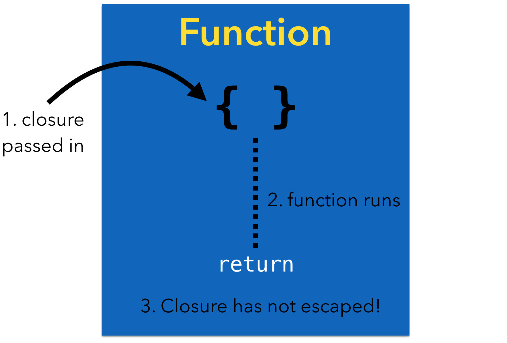

# Escaping and Nonescaping Closures in Swift 3

[Source Link](https://swiftunboxed.com/lang/closures-escaping-noescape-swift3/)

Functions and closures are *first-class objects* in Swift: you can store them, pass them as arguments to functions, and treat them as you would any other value or object. Passing in closures as completion handlers is a common pattern in many APIs we all know and love.

When you pass a closure into a function in Swift 3, there’s a new wrinkle: the compiler assumes closure parameters are *non-escaping* by default. What does this mean? What’s the difference between an escaping and a non-escaping closure?

## Non-Escaping Closures

The lifecycle of a non-escaping closure is simple:

1. Pass a closure into a function
2. The function runs the closure (or not)
3. The function returns



Notice the closure has not *escaped* the body of the function. When the function ends, the passed-in closure goes out of scope and there were no additional references made to the closure.

If you remember your memory management, you might say the retains and releases are balanced; the closure object’s retain count after the function returns is the same as it was before the function was called.

## Escaping Closures

You can probably guess what “escaping closure” means now. Inside the function, you can still run the closure (or not); the extra bit is the closure is stored some place that will outlive the function. There are several ways to have a closure escape its containing function:

- **Asynchronous execution**: If you execute the closure asynchronously on a dispatch queue, the queue will hold onto the closure for you. You have no idea *when* the closure will be executed and there’s no guarantee it will complete before the function returns.
- **Storage**: Storing the closure to a global variable, property, or any other bit of storage that lives on past the function call means the closure has also escaped.


By the time the function ends, the closure could still be out there in the world somewhere. So why does that matter?

## Escaping and Non-Escaping in Swift 3

In Swift 1 and 2, closure parameters were **escaping** by default. If you knew your closure wouldn’t escape the function body, you could mark the parameter with the @noescape attribute.

In Swift 3, it’s the other way around: closure parameters are **non-escaping** by default. If you intend for it to escape the function, you have to mark it with the @escaping attribute.

If a closure is non-escaping, there are some potential optimizations. Since the closure won’t escape the function, the compiler can optimize storage and calling for the closure.

The case you’ll run into more often is if the closure closes over self at the call site:

```swift
class ClassA {

  // takes a closure (non-escaping by default)

  func someMethod(closure: () -> Void) {

    // secret stuff

  }

}

class ClassB {

  let classA = ClassA()

  var someProperty = "Hello"

  func testClosure() {

    classA.someMethod {

      // self is captured!

      someProperty = "Inside the closure!"

    }

  }

}
```

When you call someMethod with the closure, note that someProperty is a property on ClassB. What happened to the requirement about always using self in closures? That requirement only applies to *escaping* closures and since non-escaping is the new default, you’ll have no problems running this code in Swift 3.

The closure is still capturing self but since the closure won’t live past calling someMethod, the compiler knows there’s no retain cycle risk: there’s no chance that closure parameter will make it out.

On the other hand, what if the method declaration looked like this:

```swift
func someMethod(closure: @escaping () -> Void) {

  // secret stuff

}
```

Now it’s a different story. Who knows what the method will do with the closure: store it, queue it somewhere? When you call this method and provide a closure that references a property, you *must* explicitly write self inside the closure body to remind yourself about the capture.

## The Least You Need to Know

In Swift 3, closure parameters are **non-escaping** by default; you can use the new **@escaping** attribute if this isn’t what you want. Non-escaping closures passed in as arguments are guaranteed to not stick around once the function returns.